## Table of Contents
1. [Introduction](#introduction)
2. [Installation](#installation)
3. [Preprocessing](#preprocessing)
4. [Segmentation](#segmentation)
5. [Quality Check](#quality-check)
6. [Detection](#detection)
7. [Usage Examples](#usage-examples)
8. [Troubleshooting](#troubleshooting)
9. [License](#license)

---

## Introduction

A software package for analyzing live-cell microscopy data of transcription. Includes tools for pre-processing, segmentation, motion correction, spot and cluster detection, parameter tuning, and high-confidence transcription site tracking with GUI support. Outputs include trajectories and nascent RNA quantification.

This repository contains a comprehensive software package designed for the analysis of live-cell microscopy data focused on the transcription process. The pipeline enables users to systematically process time-lapse 3D imaging datasets acquired during transcriptional activity using fluorescence microscopy techniques (e.g., MS2 systems).

Key features of the software include:

Pre-processing of Raw Imaging Data: Supports conversion from large-scale imaging formats (e.g., Imaris .ims) into manageable 3D TIFF stacks, along with motion correction and cropping of single nuclei for downstream analysis.

Segmentation and Motion Correction: Incorporates automated and manual tools for accurate segmentation of nuclei and correction of cellular movement across time.

Spot and Cluster Detection: Provides parameter optimization modules (e.g., thresholds, alpha, beta, gamma, cluster radius) for robust detection of transcription-related fluorescence spots and their clustering into transcription sites.

Interactive GUI Tools: User-friendly graphical interfaces to assist in setting thresholds, verifying segmentation, drawing transcription site outlines, and correcting tracks.

High-Confidence Transcription Site Tracking: Employs computational blurring techniques to distinguish transcription sites from freely diffusing single molecules, enhancing tracking reliability.

Final Quantification and Output: Produces detailed outputs including transcription site trajectories, spot and cluster coordinates, nascent RNA quantification, and visualization tools for validation.

The package is modular, allowing users to run individual steps or the entire pipeline depending on their experimental design. It is intended for researchers studying gene expression dynamics at single-cell and single-molecule resolution.

Thanks to these open source libraries!

## Installation

### Requirements
- Python version: `3.8`
- Required libraries: `big-fish`, `cellpose`, `scikit-image`, `napari` etc.

### Setting up the environment
1. Create the environment from the yaml file:
`conda env create -f liveQuant_092025_v3_2.yml`

2. Activate the new environment:
`conda activate liveQuant`
   

## Preprocessing

### Step 1. Convert movie file to a sequence of TIFFs

run the script in the segmentation folder called "file_convert_and_viewer.py"
A dialogue box opens up with 3 options.

1. Select a single file to process
2. Select a folder to process movies in bulk
3. Select a folder with .tif files to view

   

If you want to process a single file, click on the "Select File" button and navigate to the file to select it. A pop up appears showing the name of the file selected, click OK. Now the button "Run Processing" will be un-grayed. Click this button to start processing. The progress bar starts updating.

Once complete, a pop will appear as  below. Click OK

If you want to use the viewer functionality click on the last option "View TIFF Sequence" and a viewer appears as shown below. 

The left side shows the 4-D movie whereas the right side shows a maximum intensity projection along the Z-axis.

## Segmentation

### Step 1. Make time projections for the movies.

To map out the trajectory of the moving nuclei, we make a time projection. This will help us centre the nuclei and make motion corrections. 
Please not that this may not be efficient if the trajectories are overlapping.

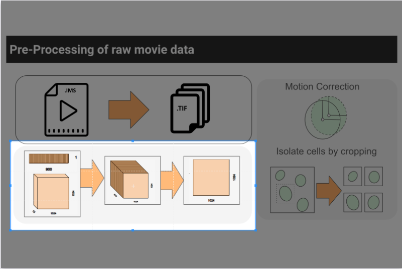

This module provides a simple graphical interface (Qt + Napari) for running Cellpose segmentation on time-lapse microscopy TIFF sequences. It:
1. Loads a pretrained Cellpose model.
2. Processes TIFF image sequences by creating time-projections.
3. Runs segmentation and saves results automatically.
4. Opens results in Napari for visualization and manual editing.
5. Allows saving the modified segmentation back to disk.

#### Launching the Tool
To launch the module, run the following script projection_and_segmentation.py which is available in the folder segmentation

`python projection_and_segmentation.py`

A small dialogue box will open up as shown in the picture below:

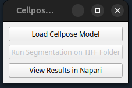

The main window will open with three buttons:

1. Load Cellpose Model
2. Run Segmentation on TIFF Folder
3. View Results in Napari

#### Load a Cellpose Model

Click "Load Cellpose Model".

Select a pretrained Cellpose model file.
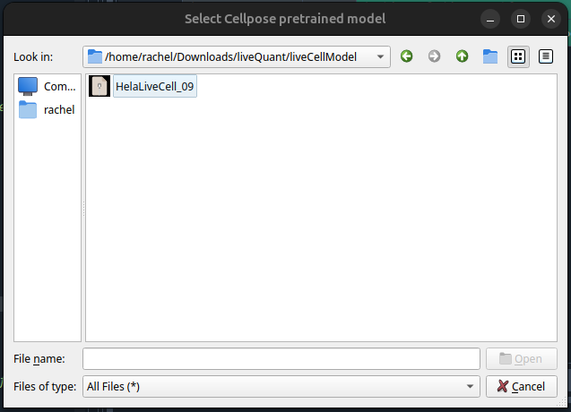

A popup will confirm the model is loaded.
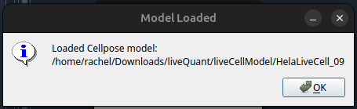

The "Run Segmentation" button becomes enabled.
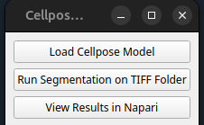

#### Run Segmentation on TIFF Folder

Click "Run Segmentation on TIFF Folder".
Choose the folder containing your TIFF image sequences.
The tool will create a subfolder named tProjections inside it.

Enter an identifier when prompted:
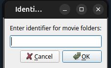
This is a text filter to match subfolders containing TIFF sequences.

For each session folder:
A time projection is generated using a maximum projection over time.
The projection is saved as a .tif file inside tProjections/.
The loaded Cellpose model performs segmentation on the projection.
Segmentation outputs (*_cp_masks.png, *_cp_outlines.png, etc.) are saved in tProjections/.

When finished, a popup confirms: “Time projections and segmentation labels saved!”
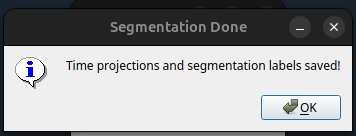

#### View Results in Napari

Click "View Results in Napari".

Select a TIFF sequence folder you processed earlier.
The tool automatically locates the corresponding tProjections/ folder.

Napari viewer will open showing:
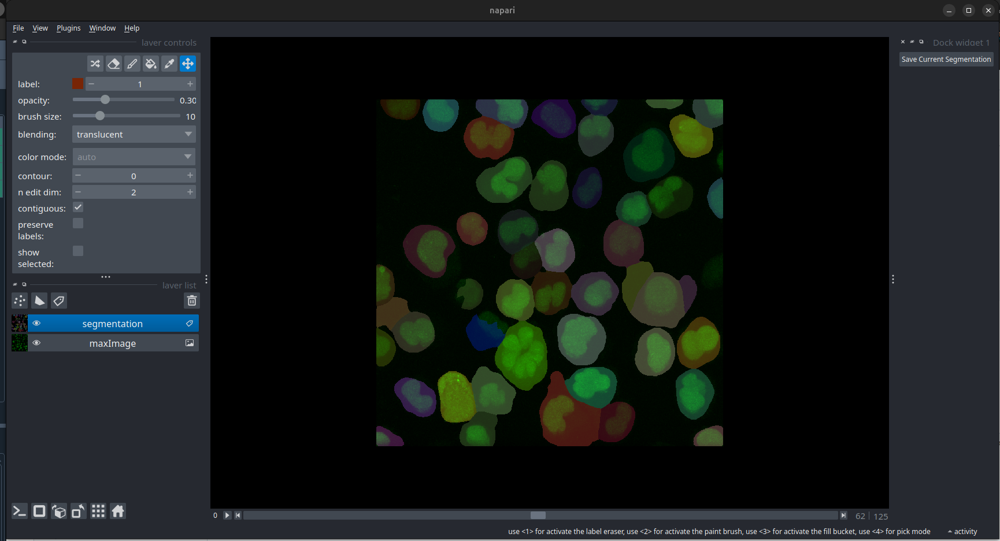
The maximum projection of the TIFF sequence (green).
The segmentation labels (if found).
A docked “Save Current Segmentation” button is available:
Allows saving edits made to the segmentation mask back to the tProjections/ folder.
Saved masks overwrite the existing *_cp_masks.png file.

####  Output Files

For each processed TIFF folder, you will find in tProjections/:

1. T_MAX_<session_name>.tif → maximum intensity time projection
2. T_MAX_<session_name>_cp_masks.png → segmentation masks
3. T_MAX_<session_name>_cp_outlines.png → outlines overlay
4. T_MAX_<session_name>_cp_flows.png → Cellpose flow output

#### Tips & Notes

Model selection: Use pretrained models from Cellpose or your own trained model.
Identifier: Use a simple string to filter session folders quickly.
Editing segmentations: Napari can be used to manually correct labels before saving.
Batch processing: The tool loops over all folders matching your identifier.

### Step 2. Motion correction and Cropping.

We use centering using the centroid and cropping in order to remove motion correction.
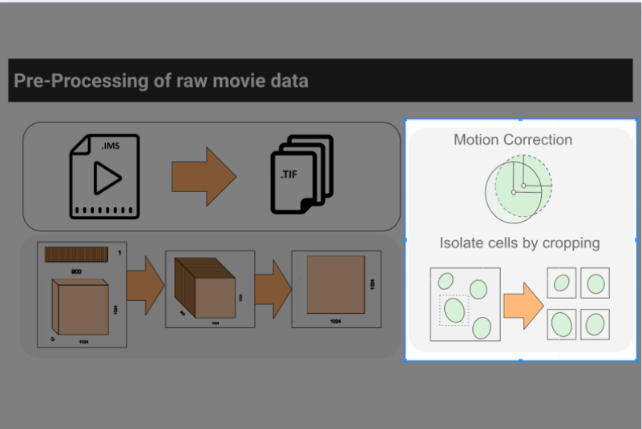

In some cases, you may not be required to do the motion correction. The tool lets you perform the cropping without it as well.

#### 1. Launching the Tool

Run the script from your Python environment:

`python cell_cropping_gui.py`

The main window will open.

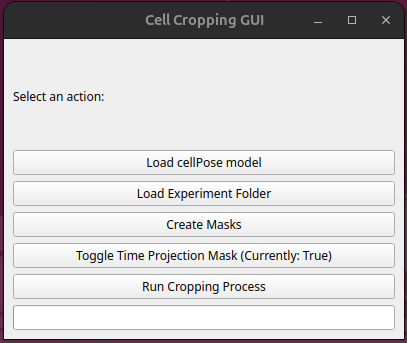

#### 2. Choosing a LiveCell Model

Click "Load LiveCell Model".

A file explorer will appear.

Navigate to your pretrained Cellpose model and select it. After selection, a pop-up confirmation will appear:
 

#### 3. Loading an Experiment Folder

Click "Load Experiment Folder".

Browse and select the folder containing your experiment sessions.

#### 4. Entering a Session Identifier

After selecting the folder, a pop-up will prompt you to enter an identifier (e.g., "TNF", "sample1").

This identifier is used to filter session folders inside your experiment directory.

The tool will list the number of sessions found that match the identifier.

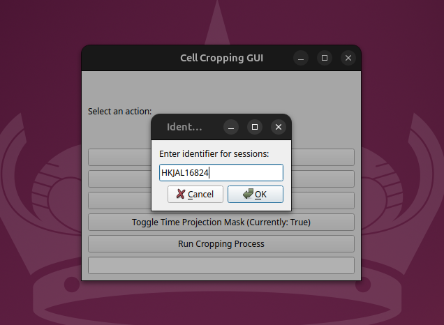

#### 5. Creating Masks

Click "Create Masks".

A dialog will appear asking how many CPU threads to use. Enter a number (default is 8).

The mask creation process will begin, and the progress bar will appear in the terminal with real-time updates as frames are processed.

#### 6. Running the Main Process

Once masks are created, click "Run Cropping Process".

This will process the experiment sessions (cropping, matching, plotting nuclei).

When complete, a confirmation popup will appear.

#### 7. Tips & Notes

TimeProjectionMask Option: You can choose whether to use time projection masks via the provided button.

Threading: For best performance, set the number of threads close to the number of CPU cores on your machine.

Output: Masks and cropped nuclei are saved inside your tempMasks/ within each FOV folder.

## Quality Check

Coming soon... (not required for jurkat cells)

## Detection

### Spot Addition Interface
For jurkat cells, the spot detection is completely manual. 

#### Overview

This application provides a small Qt-based interface embedding two napari viewers side-by-side:

Viewer 1 (left): displays the full 4D image stack (t, z, y, x) called TIFF Sequence. You add spots here by clicking (records t,z,y,x).

Viewer 2 (right): displays the timewise max-projection image called Max Projection (MIP over Z) — it shows the same time frame as Viewer 1 and displays corresponding spots projected as (t,y,x).

Main features:

Interactive cursor that synchronizes between viewers (4D → 3D projection).

Click to create spots (recorded as [t, z, y, x] in viewer1 and [t, y, x] in viewer2).

Save recorded spots to an .npz file via the Save Spots as NPZ button.

Folder selector (magicgui) to choose a base folder and a subfolder containing TIFF frames to load into both viewers.

#### Launching the app

From the terminal run the code: 

python multiview_spotter.py

The application window will appear showing the two embedded napari viewers. A Save Spots as NPZ button appears beneath the viewers. The magicgui folder chooser appears above that.

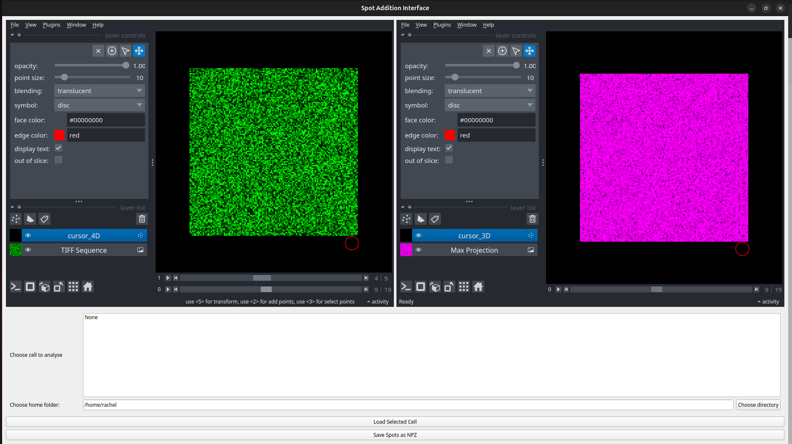

#### App description

When the app launches, you will see:

1. File navigator area at the bottom:

Choose cell to analyse: populated with subfolders whose names contain identifier (default 'cell') and have at least MaxTimePoint files.

Choose home folder: choose the parent directory that contains subfolders of image sequences.

Selecting a folder in the dropdown gives you a list of cell folders you can work with.

2. Load Selected Cell button:

Loads the chosen subfolder's TIFF frames with dask.array.image.imread (pattern folder/*.tif), adds them to Viewer 1 as the time stack and to Viewer 2 as a max-projection image.

3. Save Spots as NPZ button:

Saves the spots layer from viewer1 as an .npz file containing an array saved under the key points.

The file dialog will prompt you for a file name; the code appends '_spots' to your chosen name.

#### How to add spots (step-by-step)

Load a dataset using the magicgui + Load Selected Cell button. By default the layer 'cursor_4D' is selected.

Navigate your cursor in viewer 2 to the point you want to add. 

Find the spot in the z slice in viewer 1 using the 'Up' or 'Down' arrow key on the keyboard.

Once you are ready, use the 'PageDown' key on the keyboard to switch to the 'TIFF Sequence' layer.

Left Click using your mouse and you will see a new layer called 'spots' appear on the viewer.

Console prints a message like:
Added point at (t,z,y,x): (3, 4, 56, 75)

Use the 'PageUp' key to go back to the layer 'cursor_4D' to find new spots.

IMPORTANT NOTE: 
1. You can only add spots when the 'TIFF Sequence' layer is selected.
2. You can only see the spot locating cursor (white circle) when the 'cursor_4D' is selected.

Here's an example video:

<!--  -->

<!--  -->

[Example](https://youtu.be/JOKG7Mq5f90)
<!--more-->
