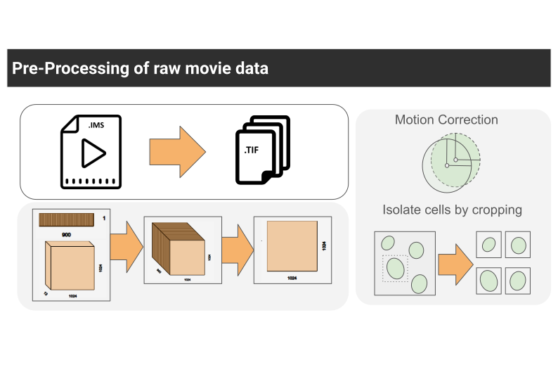
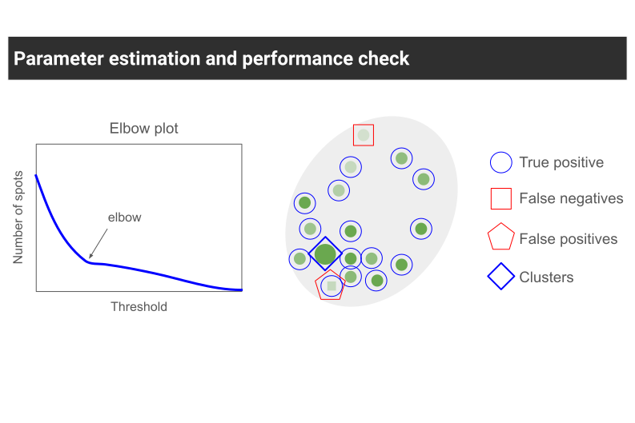
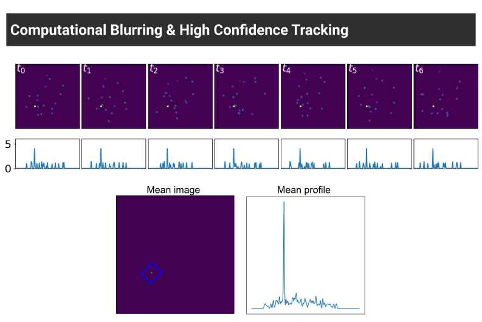
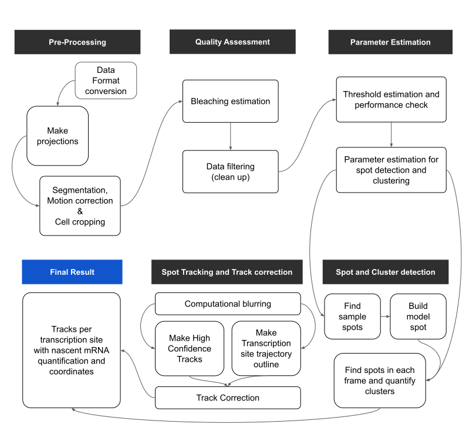
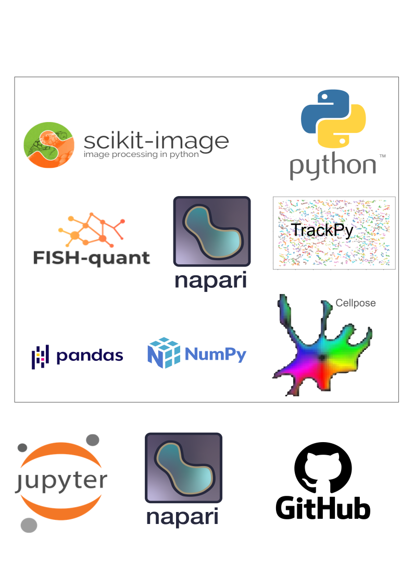
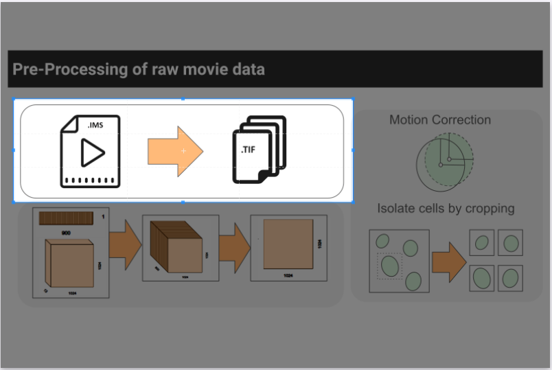
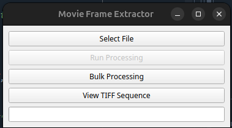
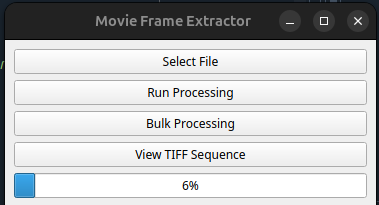
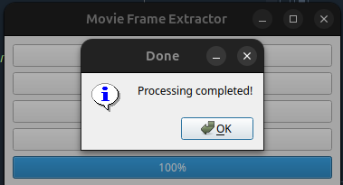
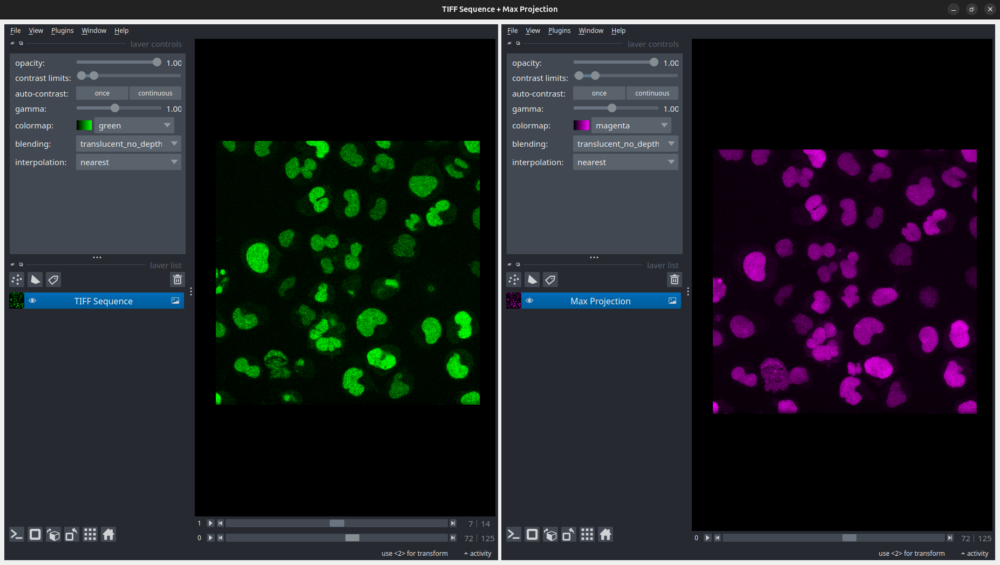

## Table of Contents
1. [Introduction](#introduction)
2. [Installation](#installation)
3. [Preprocessing](#preprocessing)
4. [Segmentation](#segmentation)
5. [Detection](#detection)
6. [Usage Examples](#usage-examples)
7. [Troubleshooting](#troubleshooting)
8. [License](#license)

---

## Introduction

A software package for analyzing live-cell microscopy data of transcription. Includes tools for pre-processing, segmentation, motion correction, spot and cluster detection, parameter tuning, and high-confidence transcription site tracking with GUI support. Outputs include trajectories and nascent RNA quantification.

This repository contains a comprehensive software package designed for the analysis of live-cell microscopy data focused on the transcription process. The pipeline enables users to systematically process time-lapse 3D imaging datasets acquired during transcriptional activity using fluorescence microscopy techniques (e.g., MS2 systems).

Key features of the software include:

Pre-processing of Raw Imaging Data: Supports conversion from large-scale imaging formats (e.g., Imaris .ims) into manageable 3D TIFF stacks, along with motion correction and cropping of single nuclei for downstream analysis.

Segmentation and Motion Correction: Incorporates automated and manual tools for accurate segmentation of nuclei and correction of cellular movement across time.

Spot and Cluster Detection: Provides parameter optimization modules (e.g., thresholds, alpha, beta, gamma, cluster radius) for robust detection of transcription-related fluorescence spots and their clustering into transcription sites.

Interactive GUI Tools: User-friendly graphical interfaces to assist in setting thresholds, verifying segmentation, drawing transcription site outlines, and correcting tracks.

High-Confidence Transcription Site Tracking: Employs computational blurring techniques to distinguish transcription sites from freely diffusing single molecules, enhancing tracking reliability.

Final Quantification and Output: Produces detailed outputs including transcription site trajectories, spot and cluster coordinates, nascent RNA quantification, and visualization tools for validation.

The package is modular, allowing users to run individual steps or the entire pipeline depending on their experimental design. It is intended for researchers studying gene expression dynamics at single-cell and single-molecule resolution.

Thanks to these open source libraries!

## Installation

### Requirements
- Python version: `3.x`
- Required libraries: `numpy`, `opencv-python`, `scikit-image`, etc.

### Setting up the environment
1. Create the environment from the yaml file:
`conda env create -f liveQuant_092025_v3_2.yml`

2. Activate the new environment:
`conda activate liveQuant`
   

## Preprocessing

### Step 1. Convert movie file to a sequence of TIFFs

run the script in the segmentation folder called "file_convert_and_viewer.py"
A dialogue box opens up with 3 options.

1. Select a single file to process
2. Select a folder to process movies in bulk
3. Select a folder with .tif files to view

   

If you want to process a single file, click on the "Select File" button and navigate to the file to select it. A pop up appears showing the name of the file selected, click OK. Now the button "Run Processing" will be un-grayed. Click this button to start processing. The progress bar starts updating.

Once complete, a pop will appear as  below. Click OK

If you want to use the viewer functionality click on the last option "View TIFF Sequence" and a viewer appears as shown below. 

The left side shows the 4-D movie whereas the right side shows a maximum intensity projection along the Z-axis.

<!--more-->
